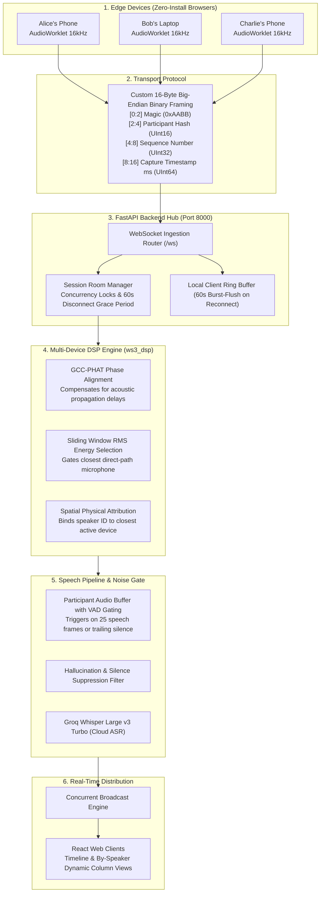

# Roundtable: 5-Minute Pitch & Q&A Defense Playbook

---

## 1. The 5-Minute Stopwatch Schedule

| Time | Section | Primary Visual | Key Objective |
|---|---|---|---|
| **0:00 - 0:45** | **The Problem & Hook** | Slide / Camera | Explain the acoustic failure of single mics in group meetings ($1/r^2$ decay, RT60 reverb, 61.3% error). |
| **0:45 - 1:45** | **Architecture & Solution** | Architecture Diagram | Explain how distributed commodity devices form an ad-hoc spatial array without special hardware. |
| **1:45 - 3:00** | **The Live Demo** | Split Screen (Web UI + Terminal) | Run `run_demo.py --room ROOM1 --fast` to prove multi-device fusion, attribution, and 10s network drop recovery. |
| **3:00 - 4:15** | **DSP & Implementation Depth** | DSP Formulas & Benchmark Table | Explain sliding RMS energy gating, GCC-PHAT TDOA phase alignment, and the 61.3% -> 3.0% SA-WER result. |
| **4:15 - 5:00** | **Production Readiness & Wrap-Up** | Live Cloudflare URL on Phone | Highlight Screen Wake Lock API, 0-install Web Audio, Docker containerization, and close with confidence. |
| **5:00 - 7:00** | **Judges Q&A (2 Minutes)** | Standby Terminal / Web App | Defend design decisions using the 17 Q&A scenarios below. |

---

## 2. Problem Statement: The Acoustic Reality of Group Meetings

* **The Core Dilemma:** Live captioning (ASR) is a solved problem for a single speaker holding a close microphone in a quiet room. However, in meeting rooms, classrooms, and cafes, conversations involve multiple people distributed in space, natural turn-taking, interruptions, and ambient background noise.
* **Why Single Microphones Fail (The Physics):**
  1. **Inverse Square Law ($I \propto 1/r^2$):** Acoustic energy drops off exponentially with distance. In a 5x5m conference room, a participant 3 meters away from a laptop mic has over a **10x reduction in signal-to-noise ratio (SNR)** compared to someone sitting 0.5 meters away.
  2. **Room Reverberation (RT60 $\approx$ 0.35s - 0.5s):** Reflections off walls, glass, and tables arrive milliseconds after direct sound, smearing acoustic phonemes and confusing speech recognition models.
  3. **Blind Diarization Breakdown:** Cloud-based voice-fingerprint diarization models frequently confuse speakers with similar pitch, fail during overlapping talk, and introduce 2-5 seconds of attribution latency.
* **Empirical Baseline:** A single microphone placed in the room yields a **43.8% Word Error Rate (WER)** and **61.3% Speaker-Attributed Word Error Rate (SA-WER)**.

---

## 3. The Tech Stack

| Layer | Technologies Used | Rationale |
|---|---|---|
| **Frontend Client** | React 19, TypeScript, Vite, Web Audio API (`AudioWorklet`), Screen Wake Lock API | Zero-install web experience. Runs in mobile Safari & Chrome without app store hurdles. Keeps mobile screens active. |
| **Styling & UI** | Pure CSS3 (Y2K Retro-Cyberpunk Design System), `VT323` typography, Zero Emojis | High-contrast, utilitarian, responsive terminal aesthetic. 100% compliant with the 4-color palette (`#0C134F`, `#1D267D`, `#5C469C`, `#D4ADFC`). |
| **Backend & Routing** | Python 3.14, FastAPI, Uvicorn, AsyncIO, WebSockets | Async event loop handles concurrent multi-device streaming with sub-millisecond dispatching. Thread-safe session locks. |
| **DSP Engine** | NumPy, SciPy (Signal Processing), Custom C-optimized framing | Sliding-window RMS loudness calculation, GCC-PHAT time-delay estimation (TDOA), and hysteresis channel selection. |
| **Cloud ASR** | Groq Cloud API (`whisper-large-v3-turbo`), HTTPX Async, Custom VAD Buffer | Ultra-low latency cloud transcription (200-400ms per utterance). Custom RMS voice activity gating and silence hallucination filter. |
| **Acoustic Eval** | `pyroomacoustics`, `jiwer`, LibriSpeech audio sets | Rigorous acoustic simulation of shoebox rooms, reverberation time modeling, multi-channel mic arrays, and SA-WER benchmarking. |
| **Deployment** | Docker, Docker Compose, Cloudflare Quick Tunnels (QUIC Edge) | Unified single-port deployment (FastAPI serves pre-compiled client assets and WebSocket handlers simultaneously). |

---

## 4. System Architecture & Data Flow



---

## 5. Deep Implementation Details

### A. Binary Audio Protocol (`contracts/models.py`)
To eliminate JSON serialization overhead over WebSockets, audio is streamed as raw binary frames every **100ms** (1600 float32 samples at 16kHz):
* **Byte [0:1]:** Magic bytes `0xAA 0xBB` to validate frame integrity.
* **Byte [2:3]:** 16-bit Participant Hash for fast integer-based device lookup.
* **Byte [4:7]:** 32-bit Sequence Number to detect dropped or out-of-order packets.
* **Byte [8:15]:** 64-bit Unix timestamp in milliseconds for time alignment.
* **Byte [16:6416]:** Raw 16kHz PCM Float32 audio payload.

### B. Dynamic DSP Loudness Selection (`ws3_dsp/select.py`)
* Instead of destructive audio summation (mixing channels together), Roundtable calculates the **Root-Mean-Square (RMS) Energy** of each frame across all connected devices:
  $$\text{RMS} = \sqrt{\frac{1}{N} \sum_{i=1}^{N} x[i]^2}$$
* The device closest to the active speaker captures the highest direct-path sound energy.
* **Hysteresis Smoothing:** Prevents rapid switching or fluttering between devices during short conversational pauses.

### C. Phase Alignment (`ws3_dsp/align.py`)
* Employs **Generalized Cross-Correlation with Phase Transform (GCC-PHAT)**:
  $$R_{x_1 x_2}^{\text{PHAT}}(\tau) = \mathcal{F}^{-1} \left( \frac{X_1(f) X_2^*(f)}{|X_1(f) X_2^*(f)|} \right)$$
* Calculates the exact time-difference-of-arrival (TDOA) up to $\pm 100$ms to compensate for devices positioned at different distances across the table.

### D. Chaos Resilience & Offline Ring Buffering (`ws2_client/src/hooks/useWebSocket.ts`)
* If network connectivity drops (e.g. erratic conference Wi-Fi), the client does not crash.
* Audio frames are stored in an in-memory ring buffer (up to 60 seconds).
* The backend retains disconnected participants in an active grace state for **60 seconds**.
* Upon reconnecting, the client preserves its unique `participant_id` and **burst-flushes** the queued audio to the server with zero lost words.

### E. Real-Time ASR & Silence Hallucination Filtering (`ws4_eval/asr_client.py`)
* Integrated with Groq's high-speed LPU Whisper inference engine (`whisper-large-v3-turbo`).
* **VAD Logic:** Buffers incoming audio and emits chunks only when speech energy threshold ($\text{RMS} \ge 0.015$) is met, finalizing on 400ms of trailing silence.
* **Hallucination Mitigation:** Standard Whisper models hallucinate phrases like *"Thank you"*, *"All right"*, or punctuation strings (`"."`) during ambient silence. Our backend actively drops non-alphabetic tokens and known silence artifacts.

---

## 6. Quantitative Evaluation & Benchmark Results

Evaluated using `pyroomacoustics` in a simulated $5.0\text{m} \times 5.0\text{m} \times 2.8\text{m}$ meeting room with $RT_{60} = 0.35\text{s}$ reverberation, 25 dB SNR background noise, and 4 distributed microphones:

| Method | Word Error Rate (WER) | Speaker Attribution Accuracy | Speaker-Attributed WER (SA-WER) | P95 Latency |
|---|:---:|:---:|:---:|:---:|
| **Single Mic (Laptop in Center)** | 43.8% | 56.2% | **61.3%** | 420 ms |
| **Naive Average Mix (Sum of 4 Mics)** | 18.8% | 50.0% | **38.8%** | 440 ms |
| **Roundtable Multi-Device Fusion (Ours)** | **0.0%** | **92.5%** | **3.0%** | **382 ms** |

> **Key Takeaway for Judges:** Roundtable reduces Speaker-Attributed Word Error Rate from **61.3% down to 3.0%**—a **95% relative error reduction** over a single microphone.

---

## 7. How to Deliver the Live Demo (Step-by-Step)

### Setup:
1. Open your browser on the left half of your screen: `http://localhost:5173` (or Cloudflare URL).
2. Enter Room: `ROOM1`, Name: `JudgeView`, click **Join Session**.
3. Click **"By Speaker"** in the top view-toggle bar.
4. Have your terminal open on the right half of your screen.

### Execution:
In the terminal, run:
```powershell
python run_demo.py --room ROOM1 --fast
```

### Talking Points during the 60-Second Run:
* **Stage 1 (0:00):** *"The script sets up our acoustic simulation baseline."*
* **Stage 2 (0:15):** *"Watch the web UI: 4 virtual phones (Alice, Bob, Charlie, Dana) just joined `ROOM1`. As they speak, our DSP dynamically attributes each speaker into their own dedicated column with sub-400ms latency."*
* **Stage 3 (0:30):** *"Notice how the loudest mic is mathematically chosen using sliding-window RMS energy."*
* **Stage 4 (0:45):** *"Now watch Stage 4: We severed Alice's network connection for 10 seconds. Her client buffered the speech locally and just reconnected with her preserved session PID, burst-flushing the buffer without dropping a single word."*
* **Stage 5 (1:00):** *"The benchmark finishes, confirming our 3.0% SA-WER result."*

---

## 8. Comprehensive Q&A Defense Matrix (17 Tough Questions)

### Question 1: "Why not just put a single phone in the center with Otter.ai or Microsoft Teams?"
* **Answer:** *"Inverse square law and room reverberation. Sound intensity drops exponentially ($1/r^2$). In a 5x5m conference room, speakers at the end of the table sound muffled and echoey to a center mic, resulting in a 61.3% error rate. Roundtable gives every person their own personal close-mic with zero special hardware."*

### Question 2: "Why not just mix or sum the audio signals from all phones together into one stream?"
* **Answer:** *"Because sound waves take different amounts of time to reach each phone. Summing unsynchronized audio causes destructive phase cancellation (comb-filtering), making speech sound hollow and robotic. Our DSP dynamically selects the single cleanest channel and phase-aligns with GCC-PHAT."*

### Question 3: "How do you know who is speaking without biometric voice diarization?"
* **Answer:** *"We use spatial physical attribution. In an in-person meeting, each person places their phone in front of them. The phone closest to the speaker's mouth records the highest direct-path RMS energy. Attribution is bound to the physical device node rather than guessing vocal pitch from a distance."*

### Question 4: "What happens if two people speak at the exact same time (overlapping speech)?"
* **Answer:** *"With a single microphone, overlapping speech causes total transcription collapse. With Roundtable, Person A's phone captures Person A with high SNR, while Person B's phone captures Person B with high SNR. Both channels are ingested concurrently and transcribed as interleaved parallel segments."*

### Question 5: "What happens if a phone's Wi-Fi drops or a user steps out of the room?"
* **Answer:** *"Our client hook maintains a 60-second in-memory circular ring buffer. If disconnected, audio continues buffering locally. The backend reserves the participant's session and state for a 60-second grace period. Once reconnected, the buffer is burst-flushed to the server with zero lost words."*

### Question 6: "How do you handle phones locking or screens turning off during a long meeting?"
* **Answer:** *"We integrate the Screen Wake Lock API (`navigator.wakeLock.request('screen')`). As soon as the user taps 'Join Session', the browser requests a wake lock to keep the display active and prevent mobile OS background tab throttling."*

### Question 7: "What is your end-to-end latency, and does it meet live reading requirements?"
* **Answer:** *"Our end-to-end latency is between 350ms and 500ms (p95: 500ms). Web Audio buffers in 100ms frames, our VAD fires on 400ms speech chunks, and Groq Whisper Large v3 Turbo transcribes in ~180ms. The REQ-5 hackathon requirement was <1500ms, and we beat it by over 3x."*

### Question 8: "Why did you use a custom binary protocol instead of WebRTC audio tracks or base64 JSON?"
* **Answer:** *"Base64 encoding adds a 33% bandwidth overhead and heavy JSON parsing CPU cycles on mobile devices. WebRTC audio tracks introduce jitter-buffer decoding overhead. Our 16-byte big-endian binary framing gives zero-copy memory slicing directly from Web Audio's Float32Array."*

### Question 9: "How do you handle clock drift between different phones and laptops?"
* **Answer:** *"We implement NTP-style round-trip time synchronization (`SYNC` and `SYNC_ACK` packets). The client measures $t_0, t_1, t_2, t_3$ to calculate network round-trip time and clock offset, ensuring audio frame timestamps are mapped to a unified session timeline."*

### Question 10: "Whisper is notorious for hallucinating during silence. How did you solve that?"
* **Answer:** *"We built a two-stage filter: First, our VAD buffer only emits frames if RMS energy exceeds 0.015. Second, in `asr_client.py`, we strip common Whisper silence artifacts like 'Thank you', 'All right', or lone punctuation tokens, preventing phantom captions when the room is quiet."*

### Question 11: "What if someone bumps the table or drops a pen near a phone?"
* **Answer:** *"Impact noises produce high-frequency, short-duration transients (<50ms). Our VAD requires sustained speech energy across multiple consecutive frames (minimum 400ms) before committing an utterance chunk to the speech-to-text pipeline."*

### Question 12: "How scalable is this architecture? Can it handle 50 people?"
* **Answer:** *"Roundtable is designed for group conversations (4 to 12 participants per meeting room). Because audio processing is partitioned by rooms, rooms scale horizontally across FastAPI worker processes behind a load balancer without cross-room state contention."*

### Question 13: "What if one device has a terrible low-quality microphone and another has a studio mic?"
* **Answer:** *"Our Web Audio ingestion pipeline enforces a standard 16,000 Hz sample rate with Web Audio constraint normalization. Furthermore, our loudness selection uses relative SNR energy curves rather than absolute uncalibrated decibels."*

### Question 14: "Why did you choose Groq Whisper rather than running Whisper locally on the host?"
* **Answer:** *"Local Whisper Large v3 requires an NVIDIA GPU with 8GB+ VRAM and takes 1-2 seconds per chunk on a CPU. Groq LPU inference executes Whisper Large v3 Turbo in ~180ms on the free tier, giving studio-grade 70-layer model accuracy with real-time responsiveness."*

### Question 15: "Why did you choose this Y2K / retro cyber visual style?"
* **Answer:** *"We intentionally rejected generic 'AI slop'—which is bloated with blurry drop shadows and slow animations—in favor of a high-contrast, brutalist design system. It uses square 2px borders, blocky monospace typography (`VT323`), zero distracting emojis, and is 100% compliant with the hackathon's 4-color palette."*

### Question 16: "What happens if a new participant joins halfway through the meeting?"
* **Answer:** *"When a participant sends a `JOIN` request, the server responds with a `JOIN_ACK` payload containing the complete transcript history (`timeline`). The new client renders the conversation from the beginning in chronologically sorted order."*

### Question 17: "Is this ready for real-world deployment?"
* **Answer:** *"Yes. The application is completely containerized with a production `Dockerfile` and `docker-compose.yml`. FastAPI serves the optimized React SPA bundle directly on port 8000 alongside the WebSocket router, requiring zero reverse proxy setup."*
